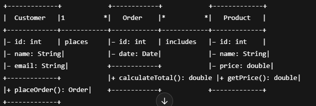

**Cohesion vs. Coupling**

- 1. What is Cohesion?
- Definition: How focused the responsibilities of a single module/class are.
- High cohesion: A class does one well‑defined job, and all its methods/fields relate to that job.
- Low cohesion: A class has mixed or unrelated responsibilities, making it hard to understand and maintain.

# Types of cohesion (from worst to best)

Coincidental cohesion: random, unrelated tasks in one class (avoid!).

- Logical cohesion: similar tasks grouped (e.g., all input routines), but not quite one purpose.
- Functional cohesion: best—everything in the class is essential to one clear responsibility.

2. What is Coupling?
   Definition: How interdependent two modules/classes are.

- Low coupling (loose coupling): classes know as little as possible about each other—ideal.
- High coupling (tight coupling): classes are heavily -intertwined, so a change in one forces changes in the other.

# Types of coupling (from worst to best)

Content coupling: one class reaches into another’s internals (fields/methods).
Common coupling: many classes share the same global data.
Stamp coupling: passing a whole object when only part is needed.
Data coupling: passing only the necessary data (best).

# Refactoring:

- Refactoring tis the process of improving the internal structure which can be both code and design of the software without altering its external behavior.

# Overview of the Unified Modeling Language (UML):

- UML is the first specification language to ever become standardized.
  
  Breakdown of the drawing

1. Class rectangles
   Each box represents a class.
   It’s divided into three compartments:
   Top: class name (Customer, Order, Product)
   Middle: attributes (fields), with visibility and type
   Bottom: operations (methods), with visibility, signature, and return type

2. Visibility notation

Symbol | Visibility | Java equivalent
 + | public | public
 - | private | private
 # | protected | protected
 ~ | package (–) | (default, no modifier)

3. Attributes

- Customer has three private fields:
  id: int
  name: String
  email: String
- Order has
  id: int
  date: Date
- Product has
  id: int
  name: String
  price: double

- Operations
  Customer exposes + placeOrder(): Order
  Order exposes + calculateTotal(): double
  Product exposes + getPrice(): double

- Associations & multiplicity
  Customer — places — Order
  The “1” near Customer means one customer.
  The “\*” near Order means many orders.
  Label places names the relationship.

- Order — includes — Product
  The "_" near Order and "_" near Product indicates a many‑to‑many association (an order can include many products; a product can appear in many orders).

# Design Pattern:

# Singleton Design Pattern

    -It is a way of designing a class so that only one object instance of that class is created.
    -e.g og singleton:

```java
public class Singleton {
    // 1. The sole instance, eagerly created (thread‑safe without sync)
    private static final Singleton instance = new Singleton();

    // 2. Private constructor prevents external instantiation
    private Singleton() {
        // initialization logic here
    }

    // 3. Public global access point
    public static Singleton getInstance() {
        return instance;
    }

    // Example business method
    public void showMessage(String msg) {
        System.out.println("Singleton says: " + msg);
    }
}

```

The singlton class is instantiated once up top and no other class can call that class instead all the classes need to call the get instance method.
-The usage of the code will look like this:

```java
public class Main {
    public static void main(String[] args) {
        // Two references, but they point to the exact same object
        Singleton s1 = Singleton.getInstance();
        Singleton s2 = Singleton.getInstance();

        System.out.println(s1 == s2);  // prints true

        s1.showMessage("Hello world!");
    }
}

```
